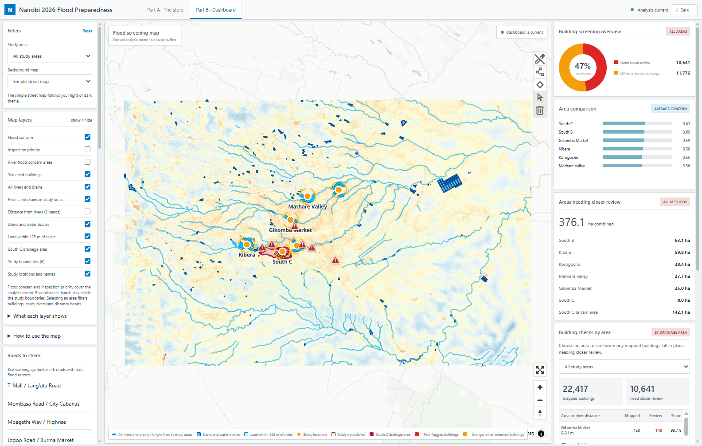
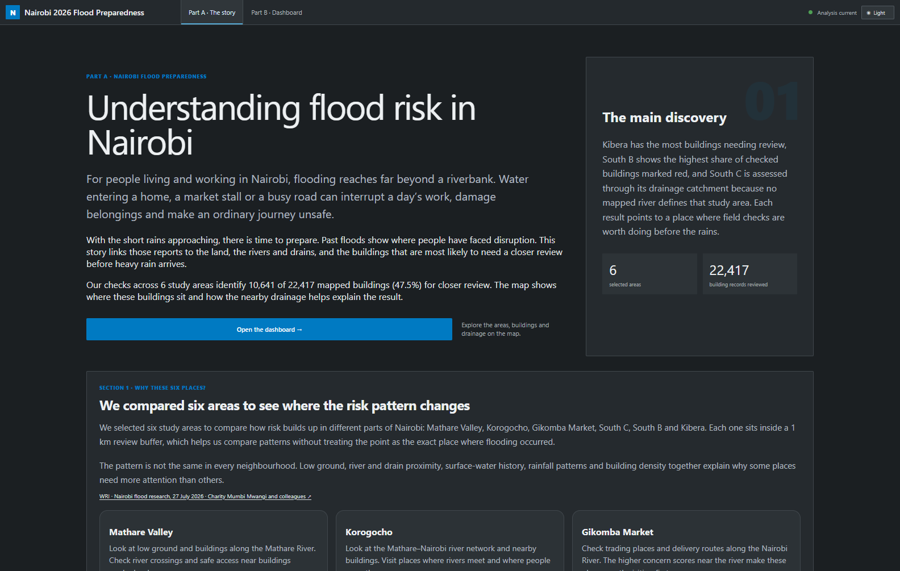

# Nairobi Flood Lens

A flood-preparedness story and interactive map for six Nairobi study areas, with the staged analysis notebook that produced the screening results.

Start with the story, explore the map, then follow the notebook to understand the method. The dashboard opens in dark mode and supports light mode, study-area filters, building popups, layer controls and map measurements.



## Open the dashboard

From the repository root:

```sh
python -m http.server 8000 --directory maplibre_dashboard
```

Open **http://localhost:8000**. The published dashboard is ready to serve; you do not need to run the notebook or install the analysis packages. Use an HTTP server rather than opening `index.html` directly. Internet access is needed for CDN libraries and external basemaps.

## Explore the findings

**Part A · The story** explains the six study areas, differences between their results, preparation priorities, methods, seasonal outlook and data sources. **Part B · Dashboard** lets you inspect individual areas and buildings.

The current snapshot screens **22,417 mapped buildings**, with **10,641 flagged for closer review**. Red buildings overlap the relevant higher-concern mask; orange buildings were screened but fall outside that mask. Orange does not mean safe. These totals describe the six study areas, not all of Nairobi or its population.



## Follow the analysis

1. Create a Python virtual environment and activate it.
2. Install the analysis dependencies: `python -m pip install -r requirements.txt`.
3. Start JupyterLab: `python -m jupyter lab`.
4. Open [Flood_Staged_Analysis.ipynb](Flood_Staged_Analysis.ipynb) and run the stages in order, reviewing each checkpoint before exporting.

The notebook uses [flood_risk_planetary.py](flood_risk_planetary.py). Its saved outputs are cleared so the repository does not embed raw data, large maps or machine-specific run results.

Raw inputs and full analysis outputs are intentionally excluded. To reproduce this exact snapshot, supply the reviewed local `raw_data/vectors/river.geojson` and `raw_data/vectors/dams.geojson` inputs and the matching configuration. The notebook can discover public raster inputs when the cache is absent, but it still requires these reviewed vector files. A new download may produce a different snapshot. See [DATA_INPUTS.md](DATA_INPUTS.md) and [model_config.example.json](model_config.example.json).

After reviewing and exporting the analysis, refresh the dashboard assets with:

```sh
python build_maplibre_dashboard.py
```

This step requires local analysis exports. It is unnecessary for viewing the bundled dashboard.

## Repository layout

| Path | Purpose |
| --- | --- |
| `maplibre_dashboard/` | Static application and runtime display assets |
| `maplibre_dashboard/data/tiles/` | Active XYZ vector tiles |
| `Flood_Staged_Analysis.ipynb` | Staged analysis and review checkpoints |
| `flood_risk_planetary.py` | Reusable analysis implementation |
| `build_maplibre_dashboard.py`, `build_dashboard_tiles.py` | Dashboard export and tiling tools |
| `forecast_scenarios/` | Narrative context and scenario settings |
| `docs/screenshots/` | Browser screenshots for these READMEs |
| `tests/` | Analysis and dashboard verification |

The Git allowlist retains only application assets, source code and supporting documentation. Runtime data includes small metrics/configuration JSON files, display GeoJSON, raster overlays and active vector tiles. Raw rasters, source caches, full analysis exports, duplicate GeoJSON tile inputs, obsolete tiles, editor files and local archives are excluded.

## Verify changes

```sh
python -m pip install -r requirements-dev.txt
python -m pytest tests/test_flood_risk_planetary.py
python tests/dashboard_browser_qa.py
```

The browser check requires installed Google Chrome and writes screenshots to the ignored `exports/` folder. `--story-only` checks the narrative and captures the full story. The data and tile checks also need the excluded local analysis exports and full GeoJSON tile inputs; they are intended for the analysis workspace.

## Sources and interpretation

The analysis uses Copernicus DEM GLO-30, ESA WorldCover, JRC Global Surface Water, TerraClimate precipitation, OpenStreetMap buildings and hydrography, and reviewed local waterways. Section 12 in the story records their roles and dates. OpenStreetMap data is credited to OpenStreetMap contributors under ODbL 1.0; other inputs retain their respective provider terms.

Concern scores are relative screening signals. They are not flood probabilities, confirmed damage, flood depths or predictions of which streets will flood. The agency weather outlook is separate from the building checks.
